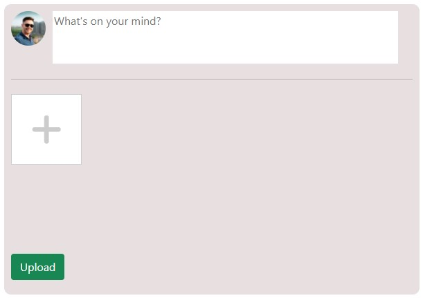
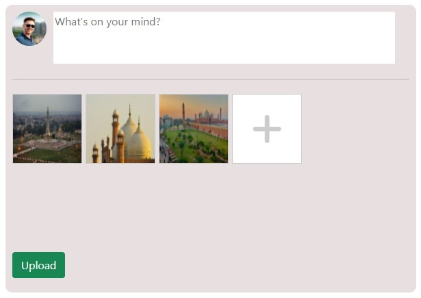

# Image-Upload-Preview

#### 😇😇 If you like my work, please start following this project's author [Syed Ali Jawad](https://github.com/alijawad1511) and don't hesitate to give star⭐ to my project to show your ❤️❤️ and support

This is a simple project in which we can preview images after selecting through input[type=file] tag.
When you select images through input tag, images which are selected, are displayed. So that you can preview which image you have selected.
You can also cancel/remove images from selected images by hovering over the image and click on cross button on image.

# THIS APPLICATION IS HOSTED ON GITHUB. VISIT THE LINK BELOW TO SEE THE PREVIEW

### Link 
https://alijawad1511.github.io/Image-Upload-Preview/

## Built With:
- HTML
- CSS
- JavaScript
- Bootstrap

## Output Samples
### Sample No. 1

### Sample No. 2

## Contact me at:
- [Gmail](mailto:jawad.bukhari1511@gmail.com)

#### 😇😋😇 If you like my work, don't hesitate to give me star ⭐⭐⭐

